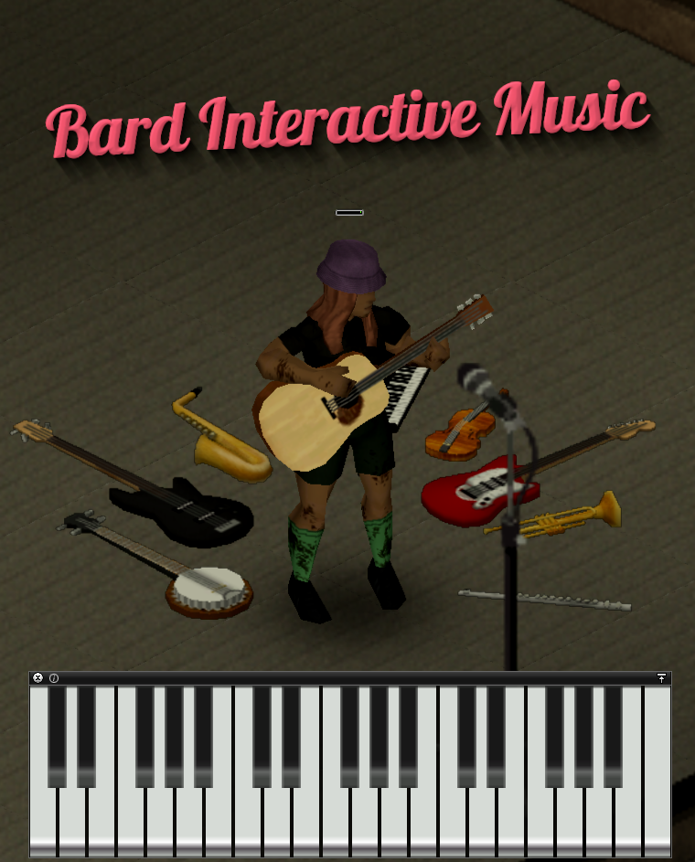

# Bard Interactive Music

A [Project Zomboid](https://projectzomboid.com) mod to play music with the keyboard.

## License

The [code and the assets](https://github.com/Phibonacci/Bard-Interactive-Music) are under MIT unless a licence file is saying otherwise.

## Credits

### Graphical assets

[Pixel Piano by Raphael Hatencia](https://ragnapixel.itch.io/pixel-piano) (Creative Commons Attribution v4.0 International)

### Sound banks

[Spanish classical guitar](https://freepats.zenvoid.org/Guitar/acoustic-guitar.html) by by roberto@zenvoid.org (CC0 1.0)

[FSBS Electric Guitar Clean #1 from freepats.zenvoid.org](https://freepats.zenvoid.org/ElectricGuitar/clean-electric-guitar.html) (CC0 1.0)

[FSBS Electric Guitar Distorted #1 from freepats.zenvoid.org](https://freepats.zenvoid.org/ElectricGuitar/distorted-electric-guitar.html) (CC0 1.0)

[Synth Lead Square from freepats.zenvoid.org](https://freepats.zenvoid.org/Synthesizer/synth-lead.html) (CC0 1.0)

[Bass Guitar FS-Y (Clean)](https://freepats.zenvoid.org/ElectricGuitar/clean-electric-bass.html) by Gary Campion and processed by freepats.zenvoid.org (GNU GPL v3)

[Tenor Saxophone](https://freepats.zenvoid.org/Reed/saxophone.html) from the Versilian Community Sample Library (CC0 1.0)

[Old Piano FB](https://freepats.zenvoid.org/Piano/honky-tonk-piano.html) by Piotr Barcz (CC0 1.0)

[Salamander Grand Piano](https://freepats.zenvoid.org/Piano/acoustic-grand-piano.html) by Alexander Holm (CC Attribution 3.0)

[Kawai-K11-Banjo](https://freewavesamples.com/instrument/banjo) by Jason Champion ([permission given without a clear licence](media/sound/Kawai-K11-Banjo/README.txt))

[Flute, Trumpet and Violin](https://philharmonia.co.uk/resources/sound-samples/) from The Philharmonia of London ([permission given without a clear licence](media/sound/Philharmonia/README.md))
